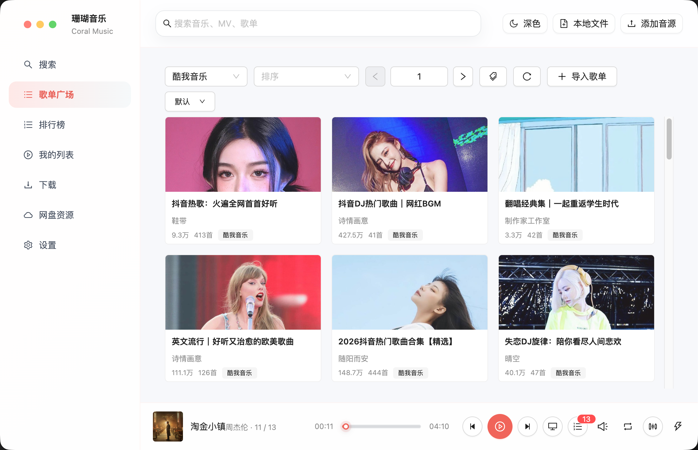

<h1 align="center">珊瑚音乐 (Coral Music) 桌面版</h1>

<p align="center">一个基于 Electron、React、MobX、Vite、TypeScript 与 Ant Design 开发的桌面音乐播放器</p>

> - 当前项目是用 React 技术栈开发的 Coral Music。正式 Coral Music 仓库、真正意义上的包含在线播放+本地全格式播放播放器；
> - 支持所有主流音频格式，超大文件DSD/SACD/DSF/DFF/ALAC/AC3/APE秒播
> - 不要将其他项目的 Releases 视为 Coral Music 发布渠道。迁移资料、兼容文档或致谢来源仅作为历史参考。

## 说明

所用技术栈：

- **Electron 40+** — 跨平台桌面应用框架
- **React 19** — UI 组件化开发
- **MobX 6** — 响应式状态管理
- **Vite 8** — 极速构建工具
- **TypeScript 5** — 类型安全的 JavaScript 超集
- **Ant Design 6** — 企业级 UI 组件库
- **Less** — CSS 预处理器
- **Electron Builder** — 应用打包分发

已支持的平台：

- Linux
- macOS
- Windows 10 及以上

## 迁移开发验证

当前分支已迁移到 Electron + React + MobX + Vite + TypeScript + Ant Design。日常开发优先使用以下命令验证：

```sh
npm run dev
npm run smoke:full
```

其中 `smoke:full` 是当前最完整的无网络验证链路，会依次执行：

1. `npm run build`
2. `npm run lint`
3. `npm run smoke:release`
4. `npm run smoke:dist`

更细粒度的验证命令：

```sh
npm run typecheck:react
npm run smoke:migration
npm run smoke:package
npm run smoke:bundle
npm run smoke:dist
npm run smoke:download
```

`smoke:download` 会启动 Electron dev 模式并验证下载运行时桥接；如果当前环境无法监听本地端口或启动 Electron，请在本机普通终端重试。

### 打包目录验证

`npm run pack:dir` 会触发 Electron Builder 下载 Electron runtime，因此它不包含在无网络 smoke 链路中。为避免默认 Electron 缓存里残留不完整下载，建议使用独立缓存目录重试：

```sh
ELECTRON_CACHE=/private/tmp/coral-electron-cache npm run pack:dir
```

成功后应生成平台对应的目录产物，例如 macOS arm64 下的 `build/mac-arm64`。

## 用户界面

<p></p>

## 贡献代码

本项目欢迎 PR，但为了 PR 能顺利合并，需要注意以下几点：

- 对于添加新功能的 PR，建议在提交 PR 前先创建 Issue 进行说明，以确认该功能是否确实需要。
- 对于修复 bug 的 PR，请提供修复前后的说明及重现方式。
- 对于其他类型的 PR，则适当附上说明。

### 一、数据来源

1.1 本项目的各官方平台在线数据来源原理是从其公开服务器中拉取数据（与未登录状态在官方平台 APP 获取的数据相同），经过对数据简单地筛选与合并后进行展示，因此本项目不对数据的合法性、准确性负责。

1.2 本项目本身没有获取某个音频数据的能力，本项目使用的在线音频数据来源来自软件设置内"自定义源"设置所选择的"源"返回的在线链接。例如播放某首歌，本项目所做的只是将希望播放的歌曲名、艺术家等信息传递给"源"，若"源"返回了一个链接，则本项目将认为这就是该歌曲的音频数据而进行使用，至于这是不是正确的音频数据本项目无法校验其准确性，所以使用本项目的过程中可能会出现希望播放的音频与实际播放的音频不对应或者无法播放的问题。

1.3 本项目的非官方平台数据（例如"我的列表"内列表）来自使用者本地系统或者使用者连接的同步服务，本项目不对这些数据的合法性、准确性负责。

### 二、版权数据

2.1 使用本项目的过程中可能会产生版权数据。对于这些版权数据，本项目不拥有它们的所有权。为了避免侵权，使用者务必在 **24 小时内** 清除使用本项目的过程中所产生的版权数据。

### 三、音乐平台别名

3.1 本项目内的官方音乐平台别名为本项目内对官方音乐平台的一个称呼，不包含恶意。如果官方音乐平台觉得不妥，可联系本项目更改或移除。

### 四、资源使用

4.1 本项目内使用的部分包括但不限于字体、图片等资源来源于互联网。如果出现侵权可联系本项目移除。

### 五、免责声明

5.1 由于使用本项目产生的包括由于本协议或由于使用或无法使用本项目而引起的任何性质的任何直接、间接、特殊、偶然或结果性损害（包括但不限于因商誉损失、停工、计算机故障或故障引起的损害赔偿，或任何及所有其他商业损害或损失）由使用者负责。

### 六、使用限制

6.1 本项目完全免费，且开源发布于 GitHub 面向全世界人用作对技术的学习交流。本项目不对项目内的技术可能存在违反当地法律法规的行为作保证。

6.2 **禁止在违反当地法律法规的情况下使用本项目。** 对于使用者在明知或不知当地法律法规不允许的情况下使用本项目所造成的任何违法违规行为由使用者承担，本项目不承担由此造成的任何直接、间接、特殊、偶然或结果性责任。

### 七、版权保护

7.1 音乐平台不易，请尊重版权，支持正版。

### 八、非商业性质

8.1 本项目仅用于对技术可行性的探索及研究，不接受任何商业（包括但不限于广告等）合作及捐赠。

### 九、接受协议

9.1 若你使用了本项目，即代表你接受本协议。

---

若对此有疑问，请通过珊瑚音乐项目配置的反馈渠道联系维护者。

## 致谢

- 本项目基于最早基于[lx music(落雪音乐)](https://github.com/lyswhut/lx-music-desktop)重构而来
- 目前已经是全新架构设计和技术栈，今后将以全新的发展路线迭代。
- 本项目遵守 Apache License 2.0 开源协议发布。
- 感谢原始项目作者与开源社区的长期贡献。

## 赞助

- 开发不易，支持开发者的话可以请开发者喝杯奶茶吧
- <p> </p>
