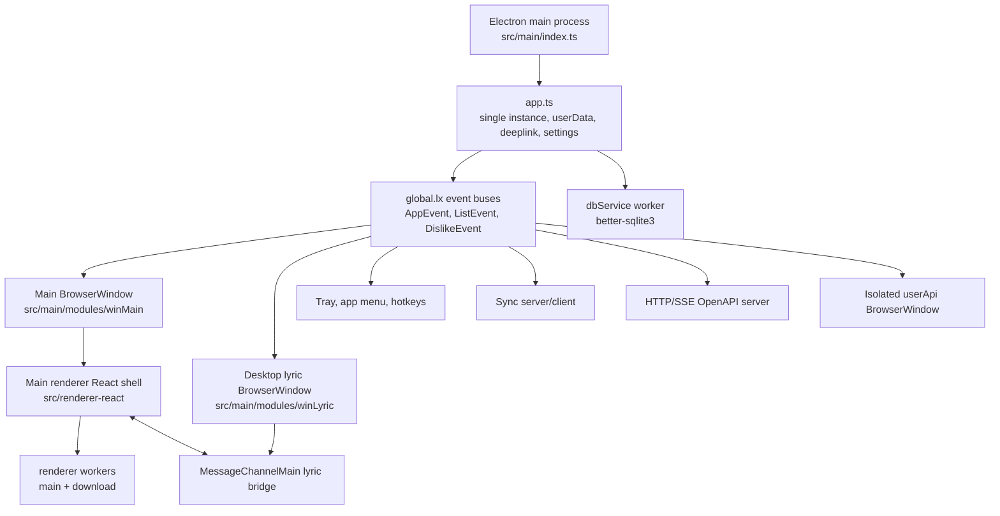

# 珊瑚音乐 Architecture Map

## Current Stack

- App: `coral-music-desktop` / 珊瑚音乐, forked from `lx-music-desktop` v2.12.2 as an Electron desktop music player refactor.
- Runtime/build: Electron 40.9.2, Node >= 22, TypeScript 5.9.3, Vite multi-entry build.
- Active UI: React + MobX + Ant Design shell for the main window and a separate React desktop lyric shell.
- Legacy UI source: `src/renderer` and `src/renderer-lyric` still exist as migration references, but Vue/Webpack config, scripts, and dependencies have been removed from the active project surface.
- State: new React surfaces use MobX stores; main process still exposes compatibility event objects on `window` and `global`.
- Persistence: `electron-store` for settings/cache-like data and `better-sqlite3` in a main-process worker for list, lyric, URL, download, and dislike data.
- IPC: string constants in `src/common/ipcNames.ts`, thin wrappers in `src/common/mainIpc.ts` and `src/common/rendererIpc.ts`.

## Build Surfaces

The active Vite build has four independent outputs:

- `main`: `src/main/index.ts` -> `dist/main.js`, SSR/Node CJS build.
- `dbService.worker`: `src/main/worker/dbService/index.ts` -> `dist/dbService.worker.js`.
- `renderer`: `src/renderer-react/index.html` + `main.tsx` -> `dist/index.html` and bundled assets.
- `renderer-lyric`: `src/lyric-react/lyric.html` + `main.tsx` -> `dist/lyric.html` and bundled assets.
- `renderer-scripts`: `src/main/modules/userApi/renderer/preload.js` -> `dist/user-api-preload.js`.

Development starts two Vite dev servers:

- Main window renderer at `http://localhost:9080`.
- Desktop lyric renderer at `http://localhost:9081/lyric.html`.

Then `build-config/runner-dev.js` watches the Vite main/preload builds and spawns Electron with `dist/main.js`.

Production build is `node build-config/pack.js`; it clears `dist/**` and `build/**`, then builds renderer, lyric, preload, and main through Vite. Packaging uses `electron-builder` through `build-config/build-pack.js`.

## Runtime Topology

## Main Process Boot Flow

`src/main/index.ts` performs these steps:

1. Import logging and common error handling.
2. `initGlobalData()` parses CLI/deeplink params and creates `global.lx`.
3. `initSingleInstanceHandle()` enforces one app instance and forwards deeplink/show behavior.
4. `applyElectronEnvParams()` applies GPU, hardware media key, proxy, and Linux GL flags.
5. `setUserDataPath()` chooses portable/user data paths and `LxDatas`.
6. `registerDeeplink(init)` registers `coralmusic://`.
7. `listenerAppEvent(init)` attaches navigation guards, native theme, proxy, and app lifecycle handlers.
8. `app.whenReady()` calls `init()`, delayed on Linux.
9. `init()` loads hotkey/settings/DB/theme, registers modules, then emits `app_inited`.

`global.lx` is the main-process compatibility hub. It stores:

- `event_app`, `event_list`, `event_dislike`.
- `appSetting`.
- `worker.dbService`.
- Hotkey config/state.
- Current theme and player status.

## Main Modules

`src/main/modules/index.ts` registers modules once:

- `userApi`: imports and runs custom source scripts in an isolated hidden window.
- `commonRenderers`: common IPC for settings, env params, list, and dislike data.
- `winMain`: main BrowserWindow, renderer IPC, update integration, taskbar controls.
- `hotKey`: local/global hotkey registration and lifecycle.
- `tray`: tray icon/menu and status bar lyric state.
- `appMenu`: native menu.
- `winLyric`: desktop lyric BrowserWindow and lyric renderer IPC.

## Renderer Boot Flow

Active React shell: `src/renderer-react/main.tsx` mounts `App.tsx`, wraps the app in Ant Design `ConfigProvider`, and uses MobX root stores from `src/renderer-react/stores`.

Legacy Vue reference: `src/renderer/main.ts`:

1. Imports common error handling and creates `window.lx` / `window.lxData` via `core/globalData`.
2. Registers renderer events and workers.
3. Fetches settings through IPC.
4. Sets language, adjusts invalid window size, initializes `store/setting`.
5. Creates the Vue app, router, i18n plugin, global components, and mounts `App.vue`.

`src/renderer/App.vue` laid out:

- Aside/navigation.
- Toolbar.
- Routed view area.
- Player bar.
- Global modals and play detail overlay.

`core/useApp/index.ts` is the main renderer bootstrap orchestrator:

- Sync, OpenAPI, mac status bar lyric.
- Main window IPC/event listeners.
- Player setup.
- Startup env/deeplink handling.
- Data initialization and previous route restoration.
- Update checks and list auto update.

## Desktop Lyric Boot Flow

Active React shell: `src/lyric-react/main.tsx` mounts `App.tsx` and keeps the desktop lyric surface independent from the main renderer.

Legacy Vue reference: `src/renderer-lyric/main.ts` fetches desktop lyric config from the main process, initializes its store, listens for setting changes and main window init, starts `core/mainWindowChannel`, and mounts a separate Vue app.

`core/mainWindowChannel.ts` receives direct messages from the main window through `MessageChannelMain`:

- Music info and lyric text updates.
- Play/pause/stop/progress status.
- Lyric offset and playback rate.
- Analyzer data requests for visualization.

## Data Flow

- Renderer actions usually call `src/renderer/utils/ipc.ts`.
- IPC reaches `src/main/modules/winMain/rendererEvent/*` or `src/main/modules/commonRenderers/*`.
- List/dislike mutations go through `global.lx.event_list` or `global.lx.event_dislike`.
- Those events write to `global.lx.worker.dbService` first, then broadcast to renderers and sync modules.
- DB worker caches list/download data in memory after first load.

## Security And Compatibility Notes

- Main and lyric windows currently use `contextIsolation: false`, `nodeIntegration: true`, `sandbox: false`, and `webSecurity: false`.
- `userApi` is more isolated: `contextIsolation: true`, `nodeIntegration: false`, custom preload, blocked navigation/window-open/permissions.
- A safe refactor should introduce typed preload bridges before enabling isolation on main/lyric renderers.
- Existing renderer code imports `electron` IPC wrappers directly, so context isolation changes are breaking unless an adapter layer exists.

## Packaging Notes

- `build-config/build-pack.js` controls `electron-builder` targets and artifact names.
- `files` manually includes native modules and `build/Release/qrc_decode.node`.
- `beforePack`/`afterPack` hooks and native binding replacement are part of the release path.
- `resources/icons`, `src/static/images/taskbar`, `src/static/images/tray`, and `licenses` must remain packaged.
